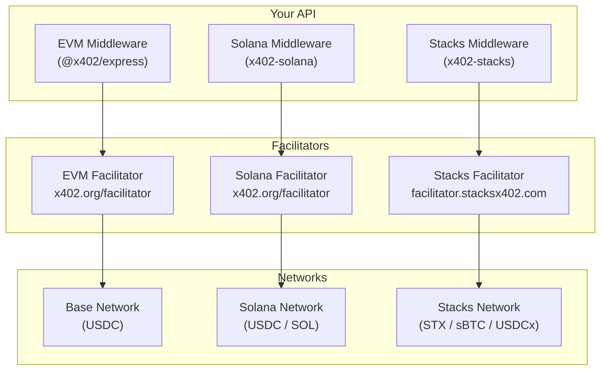
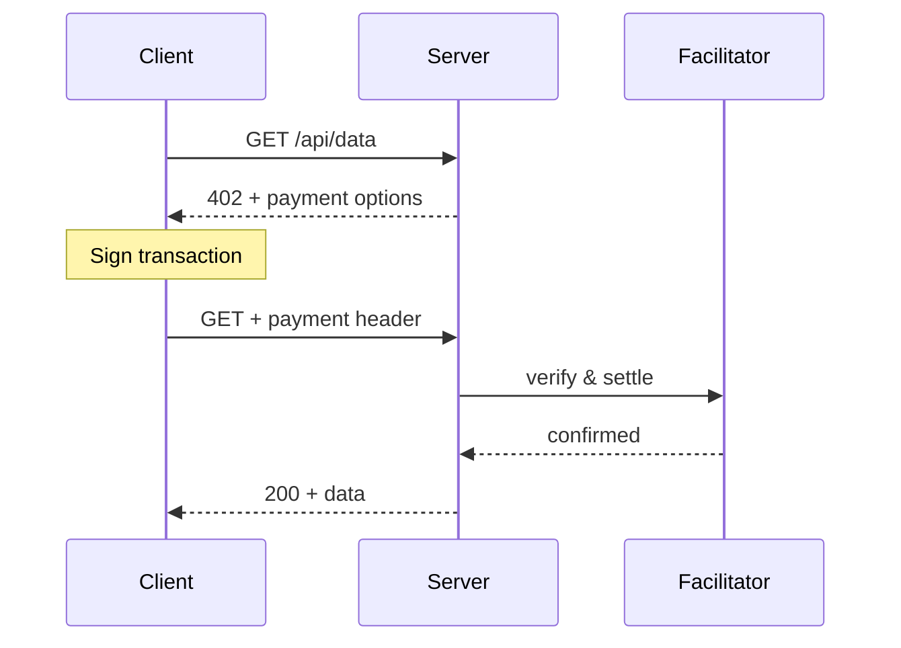

# x402 Cross-Chain Example

Add **Stacks payment support** to your existing x402 app. Whether you're on **EVM (Base)** or **Solana**, this example shows the integration pattern.

> **Coming from Base or Solana?** Jump to the [Integration Guide](docs/INTEGRATION_GUIDE.md) for step-by-step instructions.

## Quick Start

```bash
# Clone and install
git clone https://github.com/aibtcdev/x402-crosschain-example
cd x402-crosschain-example
npm install

# Configure (copy and edit .env)
cp .env.example .env

# Run server (Express on port 3000)
npm run dev

# Or run Hono server (port 3001)
npm run dev:hono

# Test clients (in another terminal)
npm run client:stacks
npm run client:evm
```

## Framework Support

This repo includes examples for both **Express** and **Hono**:

| Framework | Server | Port | Middleware |
|-----------|--------|------|------------|
| Express | `src/server/` | 3000 | `npm run dev` |
| Hono | `src/server-hono/` | 3001 | `npm run dev:hono` |

Both implementations return identical x402-compliant 402 responses.

## Why Cross-Chain?

Different networks offer different advantages. Supporting multiple chains lets users pay with their preferred assets:

| Feature | EVM (Base) | Solana | Stacks |
|---------|------------|--------|--------|
| Settlement | ~2 sec | ~400 ms | ~5 sec |
| Tokens | USDC | USDC, SOL | STX, sBTC, USDCx |
| Finality | L2 sequencer | PoH consensus | Bitcoin-anchored |
| Gasless | Paymasters | Fee payers | Sponsor relay |
| Unique value | Fast, cheap USDC | Ultra-fast, high throughput | Programmable BTC (sBTC) |

**For AI agents**: All networks support gasless transactions - Base via paymasters, Solana via fee payers, Stacks via [sponsor relay](https://github.com/aibtcdev/x402-sponsor-relay).

## Protocol Versions

The x402 protocol has two versions, both actively used. All networks use [CAIP-2](https://chainagnostic.org/CAIPs/caip-2) chain identifiers.

| Aspect | v1 | v2 |
|--------|----|----|
| **Payment Header** | `X-PAYMENT` | `Payment-Signature` |
| **Network IDs** | CAIP-2 (`stacks:1`, `eip155:1`) | CAIP-2 (`eip155:84532`) |

| Network | v1 | v2 | Package |
|---------|----|----|---------|
| EVM (Base) | [legacy](https://github.com/coinbase/x402/tree/main/typescript/packages/legacy) | ✓ | `@x402/express` |
| Solana | ✓ | ✓ | `x402-solana` |
| Stacks | ✓ | This week | `x402-stacks` |

Both versions follow the same flow: request → 402 → sign → submit → settle.

> **Note**: This repo's examples use EVM and Stacks. Solana follows the same patterns—see [x402-solana](https://github.com/PayAINetwork/x402-solana).

## Architecture



## Quick Example

Check for both headers, return 402 with all options, route to the right middleware:

```typescript
app.get("/api/data", async (req, res) => {
  const v2Payment = req.header("payment-signature");  // v2
  const v1Payment = req.header("x-payment");          // v1

  if (!v2Payment && !v1Payment) {
    return res.status(402).json({
      x402Version: 1,
      accepts: [
        { scheme: "exact", network: "eip155:84532", /* EVM */ },
        { scheme: "exact", network: "stacks:1", /* Stacks */ },
      ]
    });
  }

  if (v1Payment) return stacksMiddleware(req, res, handler);
  return evmMiddleware(req, res, handler);
});
```

**Full details:** [Integration Guide](docs/INTEGRATION_GUIDE.md)

## Payment Flow



Both versions use the same flow. v2 sends `Payment-Signature`, v1 sends `X-PAYMENT`.

## Endpoints

| Endpoint | Networks | Price | Description |
|----------|----------|-------|-------------|
| `GET /` | - | Free | API info |
| `GET /health` | - | Free | Health check |
| `GET /evm/weather` | EVM | $0.001 | Weather (EVM only) |
| `GET /stacks/weather` | Stacks | 0.001 STX | Weather (Stacks only) |
| `GET /weather` | Both | $0.001 | Weather (cross-chain) |
| `POST /stacks/ai/complete` | Stacks | 0.01 STX | AI completion |

## Configuration

```bash
# Server addresses (where payments are sent)
SERVER_ADDRESS_EVM=0xYourEvmAddress
SERVER_ADDRESS_STACKS=SP2YourStacksAddress

# Network configuration
STACKS_NETWORK=testnet  # or mainnet
EVM_RPC_URL=https://sepolia.base.org

# Facilitator URLs (these are the defaults)
EVM_FACILITATOR_URL=https://x402.org/facilitator
STACKS_FACILITATOR_URL=https://facilitator.stacksx402.com

# Client credentials (for testing)
CLIENT_PRIVATE_KEY_EVM=your_evm_private_key
CLIENT_MNEMONIC_STACKS=your twelve word mnemonic phrase
```

## Stacks Token Support

| Token | Description | Contract |
|-------|-------------|----------|
| STX | Native Stacks token | - |
| sBTC | Bitcoin on Stacks | `sbtc-token` |
| USDCx | USDC on Stacks | `usdcx` |

Specify token type with header:
```
X-PAYMENT-TOKEN-TYPE: sBTC
```

## Gasless Transactions (Sponsor Relay)

All networks support gasless transactions for AI agents:

| Network | Mechanism | Status |
|---------|-----------|--------|
| EVM (Base) | Paymasters | Available |
| Solana | Fee payers | Available |
| Stacks | [Sponsor Relay](https://github.com/aibtcdev/x402-sponsor-relay) | Coming soon |

### Stacks Sponsor Relay

Build a sponsored transaction (the relay pays gas):

```typescript
const tx = await makeSTXTokenTransfer({
  recipient,
  amount: 1000000n,
  senderKey: privateKey,
  network: "testnet",
  sponsored: true,  // Key flag
  fee: 0n,          // Sponsor pays gas
});

// Submit to relay (not directly to Stacks)
const response = await fetch("https://x402-relay.aibtc.dev/relay", {
  method: "POST",
  body: JSON.stringify({
    transaction: tx.serialize().toString("hex"),
    settle: { expectedRecipient, minAmount, tokenType }
  })
});
```

See: [x402-sponsor-relay](https://github.com/aibtcdev/x402-sponsor-relay)

## Production Deployments

| Service | Testnet | Mainnet |
|---------|---------|---------|
| x402 API | x402.aibtc.dev | x402.aibtc.com |
| Sponsor Relay | x402-relay.aibtc.dev | x402-relay.aibtc.com |
| Facilitator | facilitator.stacksx402.com | facilitator.stacksx402.com |

## Resources

### Protocol Specs
- [x402 v1 Specification](https://github.com/coinbase/x402/blob/main/specs/x402-specification-v1.md) - Transport-agnostic, `X-PAYMENT` header
- [x402 v2 Specification](https://github.com/coinbase/x402/blob/main/specs/x402-specification-v2.md) - CAIP-2 network IDs, `Payment-Signature` header

### Integration
- **[Integration Guide](docs/INTEGRATION_GUIDE.md)** - Step-by-step for supporting both protocol versions

### Stacks x402 Ecosystem
- [x402-stacks NPM](https://www.npmjs.com/package/x402-stacks) - TypeScript client/server library
- [Stacks Facilitator](https://github.com/x402Stacks/x402-stacks-facilitator) - Payment verification service
- [x402 Spec for Stacks](https://github.com/aibtcdev/x402/blob/feature/add-stacks-ecosystem/specs/schemes/exact/scheme_exact_stacks.md) - Protocol specification

### Coinbase x402
- [x402 Protocol](https://www.x402.org/) - Official site
- [x402 GitHub](https://github.com/coinbase/x402) - Reference implementation
- [@x402/express](https://www.npmjs.com/package/@x402/express) - Express middleware

### Solana x402
- [x402-solana](https://github.com/PayAINetwork/x402-solana) - Solana x402 implementation
- [PayAI Starter Templates](https://github.com/PayAINetwork) - Express, Axios, Next.js examples

### Live Examples
- [x402.aibtc.dev](https://x402.aibtc.dev) - Testnet API for development and testing
- [x402.aibtc.com](https://x402.aibtc.com) - Mainnet production API
- [stx402.com](https://stx402.com) - Stacks x402 showcase

## License

MIT
